<!-- High-End Responsive GitHub Profile Hero Banner -->
<div align="center">
  <picture>
    <source media="(prefers-color-scheme: dark)" srcset="./dark.svg">
    <source media="(prefers-color-scheme: light)" srcset="./light.svg">
    
  </picture>
</div>

<br/>

## 🚀 About Me

```zsh
thebaranberke@developer-workstation ~$ cat about_me.json
```

```json
{
  "name": "Baran Berke",
  "username": "thebaranberke",
  "role": "Full Stack & UI Engineer",
  "location": "Turkey",
  "bio": "Crafting high-performance web applications, beautiful interactive UIs, and robust AI integrations.",
  "passions": [
    "Modern Web Technologies",
    "Design Systems & Glassmorphism UI",
    "Open Source & Developer Tools",
    "AI Agents & Intelligent Workflows"
  ],
  "learning": ["Rust", "Distributed Systems", "WebGPU"]
}
```

---

## 🛠️ Tech Stack & Toolkit

<div align="center">

| Domain | Technologies |
| :--- | :--- |
| **Frontend** |     |
| **Backend** |     |
| **DevOps & Cloud** |     |
| **Design** |  |

</div>

---

## 📊 GitHub Analytics

<div align="center">
  <a href="https://github.com/thebaranberke">
    
  </a>
  <a href="https://github.com/thebaranberke">
    
  </a>
</div>

---

## 📬 Connect With Me

<div align="center">

[](https://github.com/thebaranberke)
[](https://linkedin.com/in/thebaranberke)
[](https://twitter.com/thebaranberke)
[](mailto:contact@thebaranberke.dev)

</div>

<br/>

<div align="center">
  <sub>Designed with ⚡ pure SVG animations and modern glassmorphism aesthetic.</sub>
</div>
